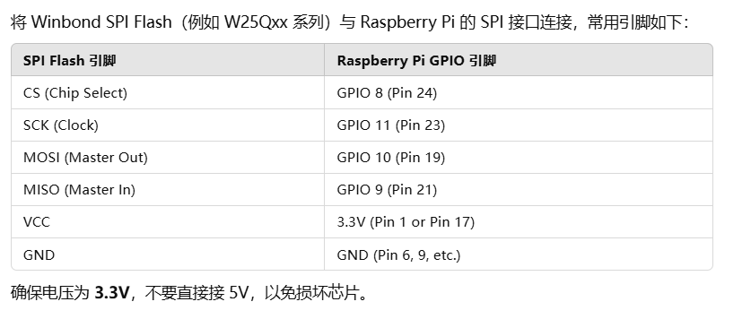

# 引脚

# cross-compile toolchain
```shell
sudo apt install gcc-aarch64-linux-gnu g++-aarch64-linux-gnu
```
# 编译
```shell
mkdir build
cd build
cmake -DCMAKE_TOOLCHAIN_FILE=../toolchain-arm64.cmake ..
make
```
# flashrom

`flashrom` 是一个开源工具，可以直接用于编程 SPI Flash。
- 安装：
```shell
sudo apt update
sudo apt install -y flashrom
```
- 检测spi flash：
```shell
sudo flashrom -p linux_spi:dev=/dev/spidev0.0 
```
输出中应该显示检测到的 Flash 芯片型号，例如：

Found Winbond flash chip "W25Q64.V" (8192 kB, SPI) on linux_spi.

- 读取spi flash：

```shell
sudo flashrom -p linux_spi:dev=/dev/spidev0.0 -r backup.bin
```
可以用dd查看读出的数据：
```shell
gx@raspberrypi:~/repo $ od -j 256 -N 512 -A x -t x1 backup.bin
000100 00 01 02 03 04 05 06 07 08 09 0a 0b 0c 0d 0e 0f
000110 10 11 12 13 14 15 16 17 18 19 1a 1b 1c 1d 1e 1f
000120 20 21 22 23 24 25 26 27 28 29 2a 2b 2c 2d 2e 2f
000130 30 31 32 33 34 35 36 37 38 39 3a 3b 3c 3d 3e 3f
000140 40 41 42 43 44 45 46 47 48 49 4a 4b 4c 4d 4e 4f
000150 50 51 52 53 54 55 56 57 58 59 5a 5b 5c 5d 5e 5f
000160 60 61 62 63 64 65 66 67 68 69 6a 6b 6c 6d 6e 6f
000170 70 71 72 73 74 75 76 77 78 79 7a 7b 7c 7d 7e 7f
000180 80 81 82 83 84 85 86 87 88 89 8a 8b 8c 8d 8e 8f
000190 90 91 92 93 94 95 96 97 98 99 9a 9b 9c 9d 9e 9f
0001a0 a0 a1 a2 a3 a4 a5 a6 a7 a8 a9 aa ab ac ad ae af
0001b0 b0 b1 b2 b3 b4 b5 b6 b7 b8 b9 ba bb bc bd be bf
0001c0 c0 c1 c2 c3 c4 c5 c6 c7 c8 c9 ca cb cc cd ce cf
0001d0 d0 d1 d2 d3 d4 d5 d6 d7 d8 d9 da db dc dd de df
0001e0 e0 e1 e2 e3 e4 e5 e6 e7 e8 e9 ea eb ec ed ee ef
0001f0 f0 f1 f2 f3 f4 f5 f6 f7 f8 f9 fa fb fc fd fe ff
000200 00 01 02 03 04 05 06 07 08 09 0a 0b 0c 0d 0e 0f
000210 10 11 12 13 14 15 16 17 18 19 1a 1b 1c 1d 1e 1f
000220 20 21 22 23 24 25 26 27 28 29 2a 2b 2c 2d 2e 2f
000230 30 31 32 33 34 35 36 37 38 39 3a 3b 3c 3d 3e 3f
000240 40 41 42 43 44 45 46 47 48 49 4a 4b 4c 4d 4e 4f
000250 50 51 52 53 54 55 56 57 58 59 5a 5b 5c 5d 5e 5f
000260 60 61 62 63 64 65 66 67 68 69 6a 6b 6c 6d 6e 6f
000270 70 71 72 73 74 75 76 77 78 79 7a 7b 7c 7d 7e 7f
000280 80 81 82 83 84 85 86 87 88 89 8a 8b 8c 8d 8e 8f
000290 90 91 92 93 94 95 96 97 98 99 9a 9b 9c 9d 9e 9f
0002a0 a0 a1 a2 a3 a4 a5 a6 a7 a8 a9 aa ab ac ad ae af
0002b0 b0 b1 b2 b3 b4 b5 b6 b7 b8 b9 ba bb bc bd be bf
0002c0 c0 c1 c2 c3 c4 c5 c6 c7 c8 c9 ca cb cc cd ce cf
0002d0 d0 d1 d2 d3 d4 d5 d6 d7 d8 d9 da db dc dd de df
0002e0 e0 e1 e2 e3 e4 e5 e6 e7 e8 e9 ea eb ec ed ee ef
0002f0 f0 f1 f2 f3 f4 f5 f6 f7 f8 f9 fa fb fc fd fe ff
000300
```
- 写入spi flash：

```shell
sudo flashrom -p linux_spi:dev=/dev/spidev0.0 -w firmware.bin
```
- 擦除：

```shell
sudo flashrom -p linux_spi:dev=/dev/spidev0.0 -E
```
# 参考

Raspberry Pi I2C_SPI Demo.mhtml


# for Luckfox Pico Pro (RV1106)
## cross-compile toolchain
- for Buildroot system: refer to https://wiki.luckfox.com/zh/Luckfox-Pico/Luckfox-Pico-RV1106/Luckfox-Pico-Pro-Max/Luckfox-Pico-quick-start
- for Ubuntu system: 
```shell
sudo apt install gcc-arm-linux-gnueabihf g++-arm-linux-gnueabihf
```
## build
```shell
mkdir build
cd build
# for Buildroot system
cmake -DCMAKE_TOOLCHAIN_FILE=../toolchain-arm-rockchip830-linux-uclibcgnueabihf.cmake ..
# for Ubuntu system
# cmake -DCMAKE_TOOLCHAIN_FILE=../toolchain-arm-linux-gnueabihf.cmake ..
make
```
